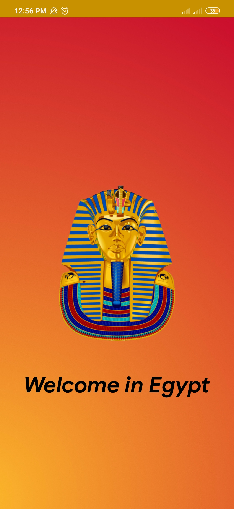
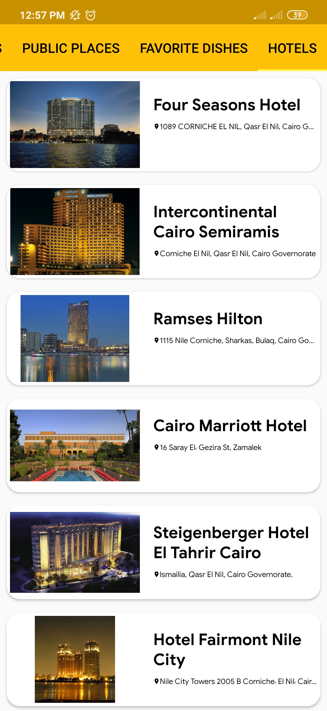

# Tour Guide App
  This project is one of Udacity Android Basics Nanodegree project.

## Using:
* Recycler View
* Fragments
* Handler Class
* Custom Class
* Butter Knife
* ViewPager Adapter

## Screen shots
 
 
 
